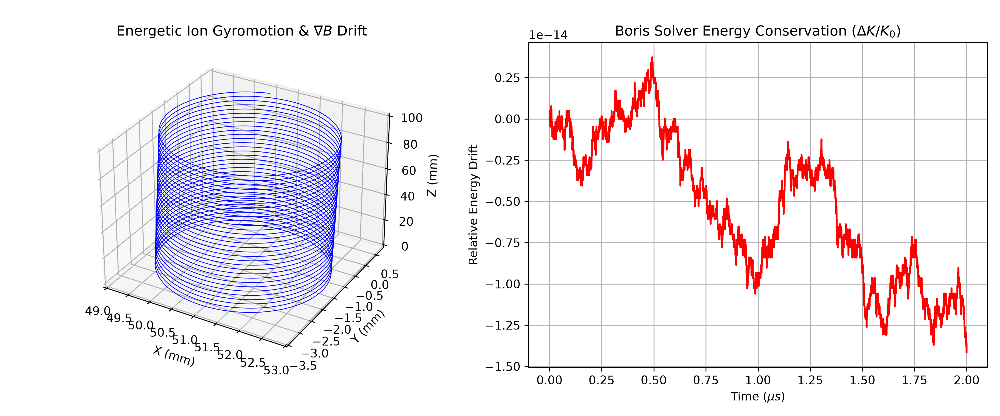

# Computational Physics: Dynamic Systems & Particle Simulations

A Python toolkit implementing numerical methods to model classical and electromagnetic dynamic systems under non-linear vector force fields.

This repository covers two core physical domains:
1. **Orbital Mechanics:** Two-body gravitational trajectory modeling using a 4th-order Runge-Kutta (RK4) integrator.
2. **Plasma Kinetics:** Charged particle gyromotion and magnetic gradient drift modeling using the Boris integration algorithm.

---

## 1. Two-Body Orbital Dynamics (RK4)

Simulates satellite trajectories in a central gravitational field by solving Newton's second law of motion:

$$\frac{d^2\vec{r}}{dt^2} = -\frac{G M}{\Vert{}\vec{r}\Vert{}^3}\vec{r}$$

* **Numerical Scheme:** Classical 4th-order Runge-Kutta (RK4) advancing coupled position and velocity differential equations.
* **Physical Validation:** Measures specific mechanical energy ($E = \frac{1}{2}v^2 - \frac{GM}{r}$) across multi-orbit durations, maintaining bounded relative energy error below 0.0001% without secular decay.


---

## 2. Energetic Particle Gyromotion & Magnetic Drift (Boris Solver)

Simulates the phase-space trajectory of an energetic ion (Deuteron) in a non-uniform magnetic field with an active gradient ($\nabla B$ drift), governed by the Lorentz force:

$$\vec{F} = q(\vec{E} + \vec{v} \times \vec{B})$$

* **Numerical Scheme:** Symplectic Boris leapfrog algorithm, phase-splitting the electric field acceleration and magnetic gyro-rotation to ensure long-term phase-space conservation.
* **Physical Validation:** Captures cyclotron gyromotion and perpendicular guiding-center drift while preserving kinetic energy in a static magnetic field.



---

## Project Structure

```text
├── README.md
├── orbital_mechanics/
│   ├── orbital_sim.py
│   └── orbital_simulation_output.png
└── plasma_particle_modeling/
    ├── boris_lorentz_sim.py
    └── particle_drift_output.png
