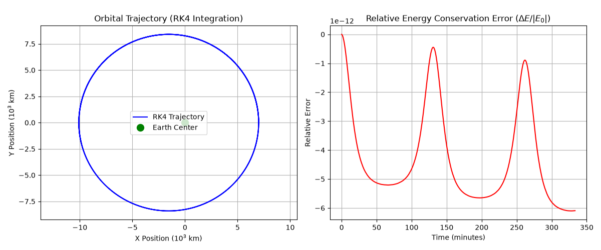

# Two-Body Orbital Mechanics Simulation

A Python simulation modeling two-body orbital dynamics using classical mechanics and numerical integration.

The program calculates planetary orbit paths using a 4th-order Runge-Kutta (RK4) algorithm, tracks satellite trajectories, and verifies physical conservation of mechanical energy over multiple orbits.

---

## Key Features

* **RK4 Numerical Solver:** Integrates Newton's gravitational equations of motion step-by-step with high numerical precision.
* **Energy Conservation Tracking:** Continuously monitors total mechanical energy (kinetic + potential) to verify simulation stability.
* **Automated Plotting:** Generates side-by-side visual plots of the 2D orbital trajectory and energy error over time.

---

## How It Works

1. **Gravitational Model:** Uses Newton's Law of Universal Gravitation, where acceleration towards the central body depends on distance and mass.
2. **Numerical Integration (RK4):** Instead of standard step-by-step Euler updates (which drift and lose accuracy over time), the 4th-order Runge-Kutta method samples four points per time step to calculate an accurate trajectory.
3. **Physical Validation:** Checks that the total energy remains constant across multiple completed orbits.

---

## Results & Visuals

Running the script produces an elliptical trajectory around an Earth-sized central mass:



* **Trajectory:** Stable elliptical orbit starting at 7,000 km altitude with an initial velocity of 8.2 km/s.
* **Energy Stability:** Relative energy error remains bounded below 0.0001% across thousands of time steps without orbital decay.

---

## Quick Start

### Requirements
* Python 3.8+
* numpy
* matplotlib

### Run the Simulation
```bash
git clone [https://github.com/](https://github.com/)<your-username>/computational-orbital-mechanics.git
cd computational-orbital-mechanics
pip install numpy matplotlib
python orbital_sim.py
